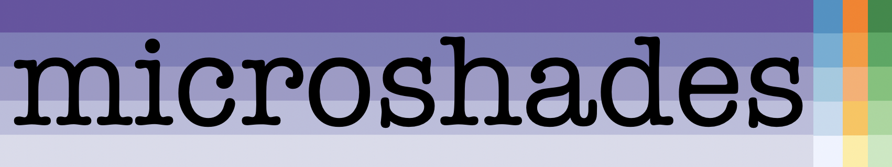
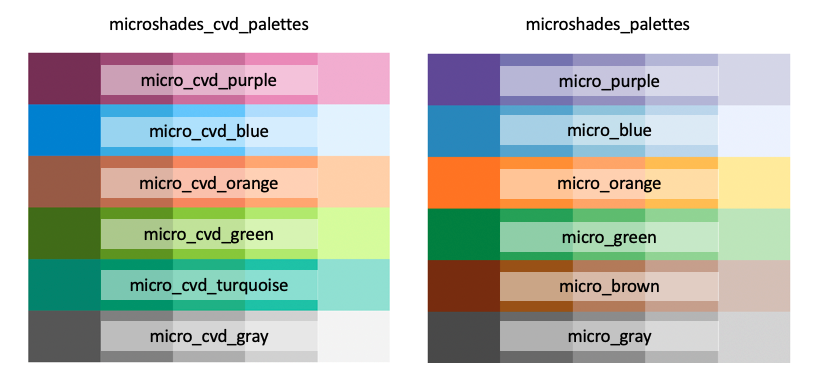
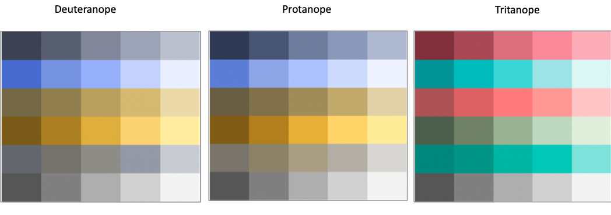
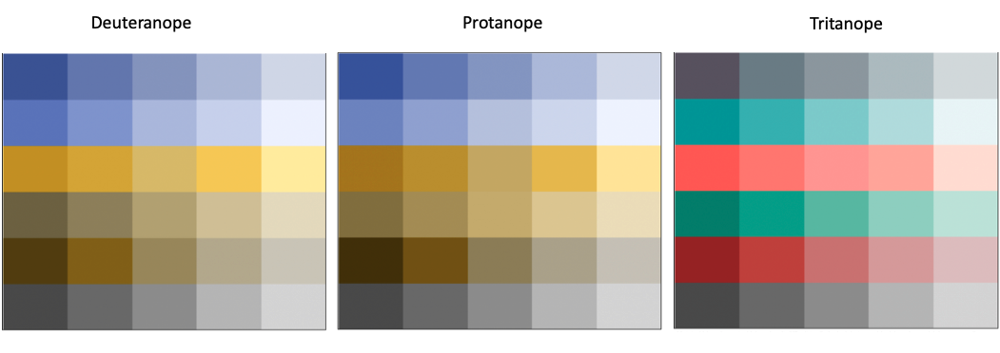
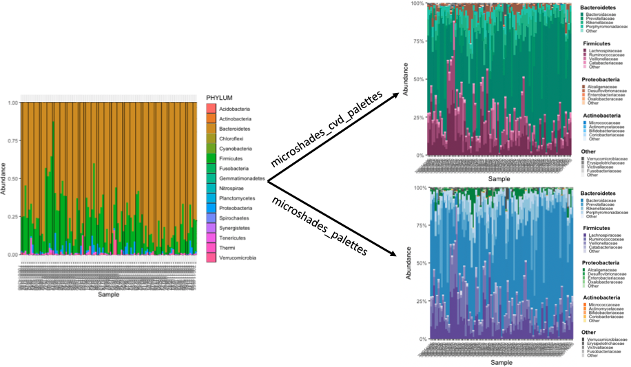
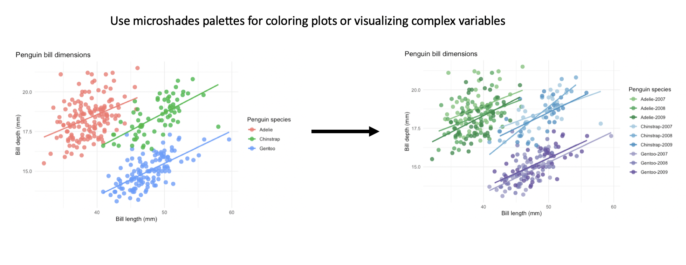

<!-- README.md is generated from README.Rmd. Please edit that file -->

```{r, include = FALSE}
knitr::opts_chunk$set(
  collapse = TRUE,
  comment = "#>",
  fig.path = "man/figures/README-",
  out.width = "100%"
)
```

```{r, echo = FALSE, fig.align='center'}

```


<!-- badges: start -->

<!-- badges: end -->

The microshades R package is designed to provide custom color shading palettes that improve accessibility and data organization. Approximately 300 million people in the world have Color Vision Deficiency (CVD), which is comparable to the most recent estimate of the US population. When creating  figures and graphics that use color, it is important to consider that individuals with CVD will interact with this material, and may not perceive all of the information tied to the colors as intended. This package includes carefully crafted palettes that improve CVD accessibility and may be applied to any plot. Additionally, there are functions to apply microshades palettes to microbiome data in a color-oriented orginazation. 


## Installation

``` r
remotes::install_github("KarstensLab/microshades")
```

If you plan to use microshades with microbiome data, you may need to install packages such as  [phyloseq](https://joey711.github.io/phyloseq/index.html) or [speedyseq](https://mikemc.github.io/speedyseq).

## The shades

Here are the two crafted color palettes,  microshades_cvd_palettes and microshades_palettes. Each color palette contains six base colors with five incremental light to dark shades, for a total of 30 available colors per palette type that can be directly applied to any plot.

```{r, echo = FALSE, fig.align='center', fig.width= 5, fig.height=4}

```


### CVD Visualization

The palettes above provide accesibilty to individuals with CVD. Below are visualizations of the palettes under a [CVD simulation](http://hclwizard.org:3000/cvdemulator). 


The three main types of CVD

- Deuteranope : This is the most common type of CVD, also know as "red-green color blindness"
- Protanope : Less common than Deuteranope, described as mutated red pigment and less ability to discriminate colors 
- Tritanope : Relatively Rare, also known as "blue-yellow color blindness"

#### microshades_cvd_palettes

The microshades_cvd_palettes contain colors that are universally CVD friendly. 

```{r, echo = FALSE, fig.align='center', fig.width= 5, fig.height=4}

```

#### microshades_palettes

The individual microshades_palettes are CVD friendly, and some microshades_palette combinations are universially CVD friendly. When using multiple microshades_palettes carefully consider color palette choices, since they may not be universally accessible. 

```{r, echo = FALSE, fig.align='center', fig.width= 5, fig.height=4}

```


To learn more about the different functions and shades in microshades, please visit the [reference](https://KarstensLab.github.io/microshades/reference) section of our website.

## Phyloseq Combatibility

In addition to color palettes, this package can also be used in conjunction with the R package phyloseq to enhance microbiome data visualization. The microshades functions create stacked bar plots from phyloseq objects, color organized by a data-driven hierarchy. The accessibility and advanced color organization features described help data reviewers and consumers notice visual patterns and trends easier. 

For detailed tutorials on how to use microshades function with phyloseq objects, please review the vignettes provided:

- [Curated Metagenomic Data](https://karstenslab.github.io/microshades/articles/microshades-CMD.html)
- [Global Patterns](https://karstenslab.github.io/microshades/articles/microshades-GP.html)
- [Human Microbiome Project](https://karstenslab.github.io/microshades/articles/microshades-HMP.html)
- [Human Microbiome Project 2](https://karstenslab.github.io/microshades/articles/microshades-HMP2.html)

Below is an example of a plot generated with microshades on Curated Metagenomic Data of the Human Microbiome. On the left is the original stacked barplot made using phyloseq. On the right are two barplot of the same data, with microshades palettes and functions applied. microshades uses coloring to correspond with taxonomic group and subgroup levels. 

```{r, echo = FALSE, fig.align='center'}

```


In this example, the phylum and genus information are explored. 
Darker shades indicate the most abundant genera for each phylum, and lighter shades are less abundant.
Users can additionally reorder the samples based on a specified taxonomic rank and name, or reorder the phylum groups.


## Apply the microshades palette to non-microbiome data

Users can apply a microshades palette color to a plot using `scale_fill_manual()` to set the custom colors and `microshades_palette()` to select a desired palette.


Please refer to the following examples with microshades on non-microbiome:

- [Palmer Penguins Data Vignette](https://karstenslab.github.io/microshades/articles/non-microbiome_data.html) 
- [Titanic Data](https://karstenslab.github.io/microshades/articles/titanic_data_example.html) 


The example below uses the palmerpenguins dataset to show how to apply the color palettes to non-microbiome data. This first plot contains the default colors from ggplot and is colored by species. The second plot uses microshades colors for a combination variable of penguin species and year of data collection. This organization can help data reviewers notice trends easier with more variables visible in the data. 

```{r, echo = FALSE, fig.align='center'}

```


