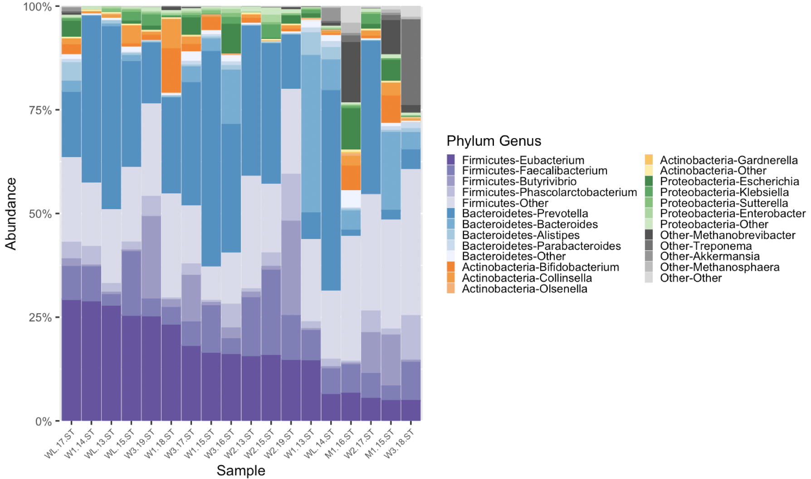

<!-- README.md is generated from README.Rmd. Please edit that file -->


<!-- badges: start -->
<!-- badges: end -->
The goal of microshades is to provide a custom color organization palette that can be applied to enhance current data visualization methods. To increase accessibility of visuals created, users may select to use color vision deficient friendly colors.

This package includes functions that work with phyloseq organized microbiome data to create stacked bar plots with advanced color organization. With microshades color organization, plots are more intuitive and accessible.

Additionally, microshades colors can be incorporated into any plot by using our palette selecting functions.

## Installation

Install microshades with devtools.

``` r
devtools::install_github("KarstensLab/microshades")
```

## The shades

Here is a list of the microshades palettes, including the CVD friendly shades

``` r
library(microshades)
#> Warning: replacing previous import 'phyloseq::psmelt' by 'speedyseq::psmelt'
#> when loading 'microshades'
#> Warning: replacing previous import 'phyloseq::tax_glom' by 'speedyseq::tax_glom'
#> when loading 'microshades'
#> Warning: replacing previous import 'phyloseq::transform_sample_counts' by
#> 'speedyseq::transform_sample_counts' when loading 'microshades'

#default shades
names(microshades_palettes)
#> [1] "micro_gray"   "micro_brown"  "micro_green"  "micro_orange" "micro_blue"  
#> [6] "micro_purple"

# cvd shades
names(microshades_cvd_palettes)
#> [1] "micro_cvd_gray"      "micro_cvd_green"     "micro_cvd_orange"   
#> [4] "micro_cvd_blue"      "micro_cvd_turquoise" "micro_cvd_purple"
```

To view any shade, use the function `microshades_palette` and specify the shade to view.

``` r
microshades_palette("micro_blue")
```


The CVD shades use the same function.

``` r
microshades_palette("micro_cvd_blue")
```


## Phyloseq useage

For detailed tutorials on how to use microshades function with phyloseq objects, please reference the following vignettes.

-   [Global Patterns](./vignettes/microshades-GP.html)
-   [Human Microbiome Project](./vignettes/microshades-HMP.html)
-   [Human Microbiome Project 2](./vignettes/microshades-HMP2.html)
-   [Curated Metagenomic Data](./vignettes/microshades-CMD.html)

Here is an example of the plot generated with microshades on Curated Metagenomic Data of the Human Microbiome.

 microshades uses coloring to correspond with taxonomic group and subgroup levels. In this example, the phylum and genus information are explored. Darker shades indicate the most abundant genera for each phylum, and lighter shades are less abundant. Users can additionally reorder the samples based on a specified taxonomic rank and name, in this example by genus "Eubacterium" abundance.

## Apply the microshades palette to other plots

To only use and apply a microshades palette color to an existing graph, use `scale_fill_manual()`. Below is an example of how to apply the color palettes to a different type of plot.

``` r
library(palmerpenguins)
library("ggplot2")
 
data(package = 'palmerpenguins')

ggplot(penguins, aes(species, fill = island)) + geom_bar() + 
         scale_fill_manual(values = microshades_palette("micro_green"))
```


