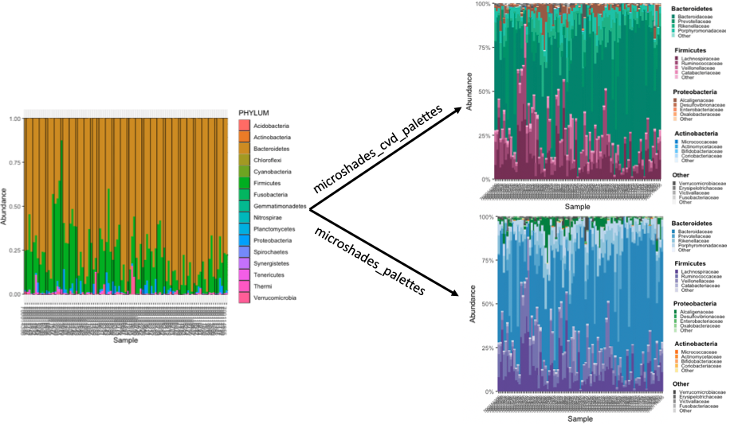

<!-- README.md is generated from README.Rmd. Please edit that file -->


<!-- badges: start -->
<!-- badges: end -->
The microshades R package is designed to provide custom color shading palettes that improve accessibility and data organization. Approximately 300 million people in the world have Color Vision Deficiency (CVD), which is comparable to the most recent estimate of the US population. When creating figures and graphics that use color, it is important to consider that individuals with CVD will interact with this material, and may not perceive all of the information tied to the colors correctly. This package includes two crafted color palettes, microshades\_cvd\_palettes and microshades\_palettes. Each color palette contains six base colors with five incremental light to dark shades, for a total of 30 available colors per palette type that can be directly applied to any plot. The microshades\_cvd\_palettes contain colors that are universally CVD friendly. The individual microshades\_palettes are CVD friendly, but when used in conjunction with multiple microshades\_palettes, are not universally accessible.

In addition to color palettes, the microshades package contains functions to aid in data visualization including functions for creating stacked bar plots organized by a data-driven hierarchy. The microshades package can be used in conjunction with common microbiome R packages, such as phyloseq, to enhance microbiome data visualization. In the case of microbiome data, the base colors correspond with a higher order taxonomic group (e.g. phylum) and shades of the base color represent subgroups of the taxonomic group (e.g. genus). Subgroup shading is determined by the abundance in the dataset. Darker shades indicate the most abundant subgroup for each group, and lighter shades represent less abundant subgroups. To further assist users with data storytelling, we have functions to sort data both vertically and horizontally based on ranked abundance or user specification. The accessibility and advanced color organization features described help data reviewers and consumers notice visual patterns and trends easier.

Please visit our [website](https://karstenslab.github.io/microshades) to learn more about microshades.

## Installation

``` r
remotes::install_github("KarstensLab/microshades")
```

If you are having trouble with installation, you may need to install packages such as [phyloseq](https://joey711.github.io/phyloseq/index.html) or [speedyseq](https://mikemc.github.io/speedyseq) before installing microshades.

## The shades

Here is a list of the microshades palettes, including the CVD friendly shades

``` r
library(microshades)

# main shades
names(microshades_palettes)
#> [1] "micro_gray"   "micro_brown"  "micro_green"  "micro_orange" "micro_blue"  
#> [6] "micro_purple"

# cvd shades
names(microshades_cvd_palettes)
#> [1] "micro_cvd_gray"      "micro_cvd_green"     "micro_cvd_orange"   
#> [4] "micro_cvd_blue"      "micro_cvd_turquoise" "micro_cvd_purple"
```

To view any shade, use the function `microshades_palette` and specify the shade to view.

``` r
microshades_palette("micro_blue")
```


The CVD shades use the same function.

``` r
microshades_palette("micro_cvd_blue")
```


To learn more about the different functions and shades in microshades, please visit the [reference](https://KarstensLab.github.io/microshades/reference) section of our website.

## Phyloseq Combatibility

For detailed tutorials on how to use microshades function with phyloseq objects, please review the [vignette articles](https://KarstensLab.github.io/microshades) on the website.

Below is an example of a plot generated with microshades on Curated Metagenomic Data of the Human Microbiome. On the left is the original stacked barplot made using phyloseq. On the right are two barplot of the same data, with microshades palettes and functions applied.



microshades uses coloring to correspond with taxonomic group and subgroup levels. In this example, the phylum and genus information are explored. Darker shades indicate the most abundant genera for each phylum, and lighter shades are less abundant. Users can additionally reorder the samples based on a specified taxonomic rank and name, or reorder the phylum groups.

## Apply the microshades palette to non-microbiome data

To apply a microshades palette color to a plot, use `scale_fill_manual()`.

The following examples use the palmerpenguins dataset to show how to apply the color palettes to non-microbiome data.

This first example examines the number of each species of penguin. The different color shades represent the island that the penguin was located.

``` r
library(palmerpenguins)
library(dplyr)
#> 
#> Attaching package: 'dplyr'
#> The following objects are masked from 'package:stats':
#> 
#>     filter, lag
#> The following objects are masked from 'package:base':
#> 
#>     intersect, setdiff, setequal, union
library("ggplot2")
 
data(package = 'palmerpenguins')

ggplot(penguins, aes(species, fill = island)) + geom_bar() + 
         scale_fill_manual(values = microshades_palette("micro_green"))
```


This next example examines the flipper length to body mass measurements between different penguin species. To add an enhanced detail to the visual, a combination variable was created in this example that contains the species and year. The different base colors represent the species and the shades represent the year that the data was collected.

``` r
penguins_mod <- penguins %>% mutate(combination_variable = paste(species, year, sep = "-"))

hex_values <-c(microshades_palette("micro_green", 3, lightest = FALSE), 
               microshades_palette("micro_blue", 3, lightest = FALSE), 
               microshades_palette("micro_purple", 3, lightest = FALSE))

ggplot(penguins_mod, aes(x = flipper_length_mm,
                            y = body_mass_g)) +
  geom_point(aes(color = combination_variable)) +
  theme_minimal() +
  scale_color_manual(values = hex_values, na.translate = FALSE) +
  labs(title = "Penguin flipper and body mass",
       x = "Flipper length (mm)",
       y = "Body mass (g)",
       color = "Penguin Species and Year") +
  theme(legend.position = "bottom",
        legend.background = element_rect(fill = "white", color = NA),
        plot.title.position = "plot",
        plot.caption = element_text(hjust = 0, face= "italic"),
        plot.caption.position = "plot") +
  facet_wrap(~species)
#> Warning: Removed 2 rows containing missing values (geom_point).
```


This last example examines the bill length to depth measurements between different penguin species. The combination variable generated for the previous example is used for this plot as well. The different base colors represent the species and the shades represent the year that the data was collected.

``` r
 
bill_len_dep <- ggplot(data = penguins_mod,
                         aes(x = bill_length_mm,
                             y = bill_depth_mm,
                             group = combination_variable)) +
  geom_point(aes(color = combination_variable),
             size = 3,
             alpha = 0.8) +
  geom_smooth(method = "lm", se = FALSE, aes(color = combination_variable)) +
  theme_minimal() +
  scale_color_manual(values = hex_values, na.translate = FALSE) +
  labs(title = "Penguin bill dimensions",
       x = "Bill length (mm)",
       y = "Bill depth (mm)",
       color = "Penguin species",
       shape = "Penguin species") +
  theme(legend.position = "right",
        legend.background = element_rect(fill = "white", color = NA),
        plot.title.position = "plot",
        plot.caption = element_text(hjust = 0, face= "italic"),
        plot.caption.position = "plot")

bill_len_dep
#> `geom_smooth()` using formula 'y ~ x'
#> Warning: Removed 2 rows containing non-finite values (stat_smooth).
#> Warning: Removed 2 rows containing missing values (geom_point).
```


